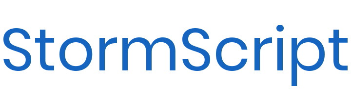

[](https://github.com/stormprograms/StormScript/blob/master/LICENSE)


[](https://snapcraft.io/stormscript)

## How to Build

Terminal:

To build StormScript clone this repository and cd into it. Run 
```
$ cmake CMakeLists.txt
```
and
```
$ make
```
You can then add it to path or install it to /usr/bin.

Visual Studio Code:

Clone this repository like before and open it in Visual Studio Code. Make sure you have the CMake, C++, and python plugins installed. Press `Build:` in the bottom left or press `f5` to start debugging.

When it builds, it should be put into a `build/` directory.

## Layout

Folder | Description
------ | -----------
docs/ | contributing guide, code of conduct. etc.
src/core/ | The core StormScript files
src/stream/ | Files that deal with the console.
build-scripts/ | Scripts to be packaged with releases
src/classes/ | Files that deal with classes.
src/values/ | Files that deal with variables and functions.
tests/ | Files for testing that core functionality is not messed up.

## Files You Should Know

file | Description
---- | -----------
[src/core/stsclasses.h](src/core/stsclasses.h) | This is where all classes needed for a program to run are put.
[src/core/stormscript.cpp](src/core/stormscript.cpp) | This is where files are read.
[src/core/errors.cpp](src/core/errors.cpp) | This is where all new errors are added.
[src/parser/parse.cpp](src/parser/parse.cpp) | This is the parser.
[src/interpreter/exec.cpp](src/interpreter/exec.cpp) | This is the function that interprets functions
